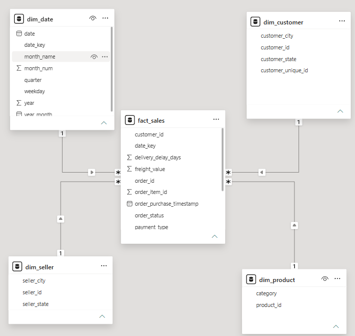
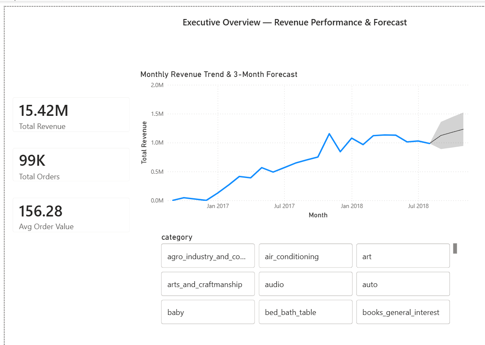
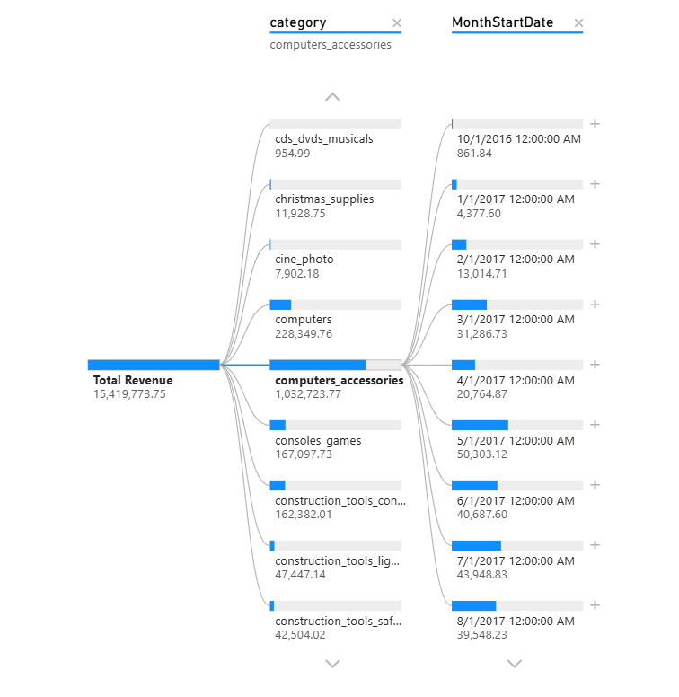
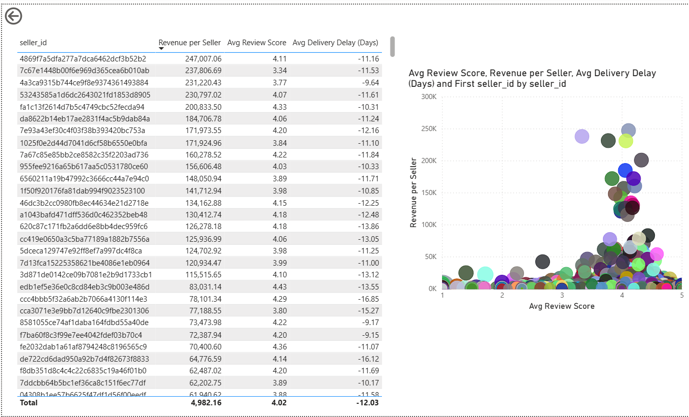
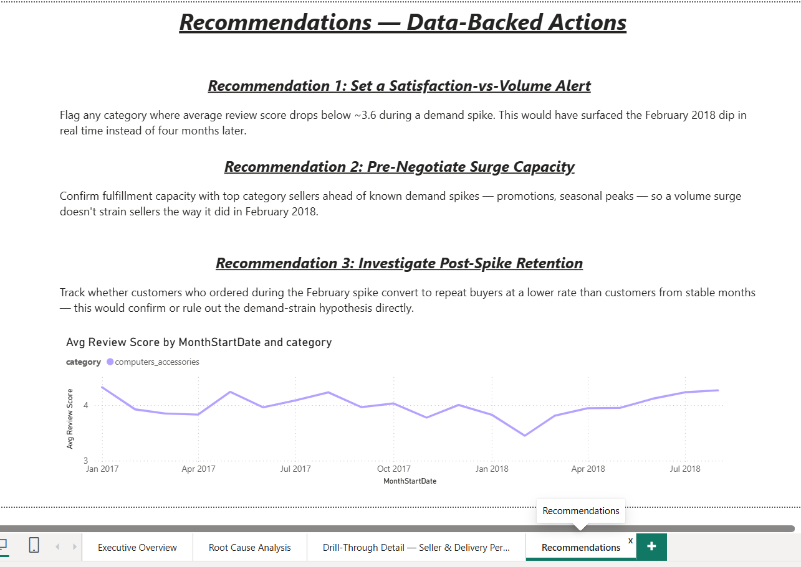

# Sales Decline Root-Cause Investigation | Power BI

Root-cause investigation of a real revenue decline in the Olist Brazilian e-commerce dataset — not a generic sales dashboard, but a diagnostic project that answers *why* revenue dropped in a specific category and what to do about it.

## Business question
The Computers & Accessories category hit its highest monthly revenue ever in February 2018, then dropped 57% over the next four months while the rest of the marketplace stayed flat or grew. This project investigates why, rules out the obvious explanations, and lands on the one the data actually supports.

## Project walkthrough


## Dataset
[Olist Brazilian E-Commerce Public Dataset](https://www.kaggle.com/datasets/olistbr/brazilian-ecommerce) — real transactional data from an actual Brazilian marketplace, ~100K orders, 2016–2018. Anonymized but not synthetic. Tables used: orders, order items, products, customers, sellers, reviews, payments, category translation.

This is a self-directed analysis of public data, not a live business engagement — I picked the question, not a manager. Framed that way in interviews too.

## Data model
Star schema — one fact table, four dimension tables.

- `fact_sales` — order-item grain: price, freight, revenue (delivered orders only), review score, delivery delay, payment type
- `dim_date` — full calendar table, marked as the official date table for time intelligence, with an added `MonthStartDate` column (first day of each month) used to give line charts clean monthly points on a true continuous date axis, which is what makes Power BI's built-in forecasting work
- `dim_product` — product to category (English-translated)
- `dim_customer` — customer to state/city
- `dim_seller` — seller to state/city



## What I found
- Computers & Accessories revenue: **~R$118K (Feb 2018) → ~R$51K (Jun 2018)**, a ~57% peak-to-trough drop, visible directly in the decomposition tree below
- Total marketplace revenue over the same months barely moved — so this is a category-specific problem, not a seasonal or platform-wide one
- Ruled out delivery delays (actually got faster), pricing (barely moved), and seller attrition (seller count stayed roughly flat through Q2)
- The one thing that lines up: February 2018 also had the category's lowest average review score in the whole dataset (~3.5, versus a normal 4.0–4.3), right at the same time as the order volume spike — reads like sellers got overwhelmed by demand they weren't ready for, and it likely cost them repeat/referral demand afterward
- At the individual seller level, there's no clean cutoff where low-rated sellers also earn less revenue — the pattern is a time-based, category-wide dip, not something explained by any single seller's rating. Stating this plainly rather than overclaiming a link the data doesn't clearly show

Full writeup with the ruled-out hypotheses table: `docs/insight_report.md`

## DAX measures
All measures live in a single `_Measures` table (no data, just a container) rather than being scattered across the model tables — keeps things easy to find when demoing.

Covers: core aggregates (Total Revenue, Total Orders, Avg Order Value), time intelligence (MoM/YoY growth, rolling 3-month average, peak month revenue), diagnostic measures (cancellation rate, avg review score, avg delivery delay, revenue per seller), and decline-specific flags (Revenue vs Peak %, Decline Flag). Full list with explanations: `docs/DAX_measures.md`

## Report pages

### Page 1 — Executive Overview
Total Revenue, Total Orders, and Avg Order Value cards, a monthly revenue trend line with a native Power BI forecast overlay (3-month projection, 95% CI), and a category slicer to filter the whole page.



### Page 2 — Root Cause Analysis
A Decomposition Tree (Total Revenue → category → month) that lets you drill down live and land on the exact Feb→Jun 2018 pattern — you can see `computers_accessories` at 1,032,723.77 total, with the monthly breakdown branching out on the right.



### Page 3 — Drill-Through Detail
A seller-level table (Revenue per Seller, Avg Review Score, Avg Delivery Delay) next to a scatter chart (review score vs. revenue, bubble size = delivery delay) — set up as an actual drill-through target from category selections elsewhere in the report.



### Page 4 — Recommendations
Three data-backed actions, each tied to a specific piece of evidence from the investigation, plus a supporting chart showing the review-score dip that Recommendation 1 is based on.



## Repo structure
```
data/                          cleaned star-schema CSVs, ready to import
  DAX_measures.md              every measure, with the real numbers they produce
  insight_report.md            full findings + recommendations
screenshots/                   all 4 report pages + model view
sales_decline.pbix             the Power BI file — open in Power BI Desktop (free) to explore interactively
project_walkthrough.mp4        2-minute video walkthrough
```

## Tools
Power BI · DAX · Power Query · Data Modeling (Star Schema)

## A note on access
No live Power BI Service link — publishing requires a Microsoft 365 organizational account, which I don't currently have. Instead, download `sales_decline.pbix` and open it in Power BI Desktop (free) to click through everything live, or watch the walkthrough video above.

## Caveat, stated upfront
The review-score explanation is the strongest correlated signal in the data, not a proven cause — this dataset has a very low overall repeat-purchase rate (~3%), so a clean "bad experience → lost repeat customer" chain can't be fully confirmed without seller-side fulfillment data I don't have access to. Said plainly in the insight report too — didn't want to oversell a correlation as a certainty.
